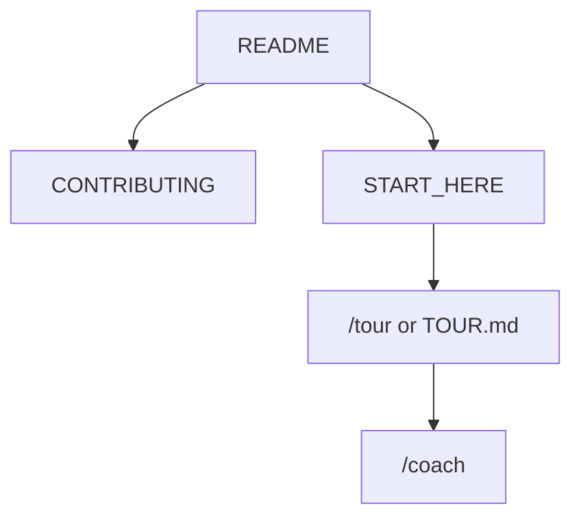

<!-- GENERATED by scripts/generate-project-readme.py — edit branding/product.json -->

  

<h1 align="center">StarRupture City Planner</h1>

<strong>Offline PWA to plan West-to-East StarRupture city layouts from an unlock checklist</strong>

  
  
  
  
  
  

  

## Pitch

StarRupture City Planner is a fully offline, installable PWA that helps a StarRupture player sketch a West-to-East city layout before building it. Start from a curated unlock checklist, place and toggle buildings on a West-to-East strip, and save your plan — everything runs locally with LocalStorage persistence and no backend, no analytics, no third-party runtime dependencies. Built on the agent-project-bootstrap foundation with Lighthouse ≥ 0.9 floors.

## Demo

  

> Add screenshots or a short demo GIF under `docs/images/` and link them here when available.

## Features

- Curated StarRupture building + unlock checklist as the core input (seeded, static data)
- West-to-East layout editor with grid placement, keyboard-only nav, and reduced-motion support
- LocalStorage-only persistence with versioned schema + migration — fully offline after first load
- PWA: installable, service-worker precached, Lighthouse perf/a11y/best-practice ≥ 0.9 budgets
- FOSS (MIT) — no cloud, no telemetry, no paid SaaS, no third-party runtime deps

## Quick start

1. Open the app (dev: `npm run dev` in `examples/web/` after `npm ci`).
2. Tap **Plan city** on the current (unlocked) city to open the West-to-East layout editor.
3. Place buildings from the unlock checklist, then **Save layout** — your plan persists offline and the next city unlocks.

## For humans

Start with this README, then [`CONTRIBUTING.md`](CONTRIBUTING.md) and [`docs/BEST_PRACTICES.md`](docs/BEST_PRACTICES.md). The first-month playbook is [`docs/FIRST_30_DAYS.md`](docs/FIRST_30_DAYS.md).

## For agents

Read [`docs/START_HERE.md`](docs/START_HERE.md) and [`AGENTS.md`](AGENTS.md). In Cursor type `/tour` or `/bootstrap`. Any other IDE: ask the agent to read [`docs/help/TOUR.md`](docs/help/TOUR.md). `/coach` is the next recommended action.

## Install

No install required — installable PWA via browser or GitHub Pages. Local dev: Node 20+, then `cd examples/web && npm ci`. Build: `npm run build` (outputs `dist/`, deployed via `.github/workflows/pages.yml`).

## Usage

Browse your cities West-to-East; tap **Plan city** to open the layout editor; place buildings from the unlock checklist and save. Your plan persists in LocalStorage and works offline. Use `/build` on `BUILD_PLAN.md` for next steps and `/gates` before merge.

## Configuration

Copy [`.env.example`](.env.example) to `.env` for local secrets (never commit `.env`). Stack-specific config lives in the active `examples/` or app root after prune.

## Contributing

See [`CONTRIBUTING.md`](CONTRIBUTING.md). Prefer small PRs; follow Conventional Commits and the BUILD_PLAN labels (`AGENT` / `HUMAN` / `ADB` / `AUTO`). Status markers: 🔲 open · ✅ done · ❌ blocked.

## Security

See [`SECURITY.md`](SECURITY.md). Enable Dependabot alerts and follow [`docs/SECURITY_TRIAGE.md`](docs/SECURITY_TRIAGE.md) for weekly CVE triage.

## License

[MIT License](LICENSE) — see the license file for terms.

## Acknowledgments

Scaffolded with [agent-project-bootstrap](https://github.com/edwardlthompson/agent-project-bootstrap). Brand assets: [`branding/BRANDING.md`](branding/BRANDING.md). Design system: [`docs/DESIGN_GUIDE.md`](docs/DESIGN_GUIDE.md).
