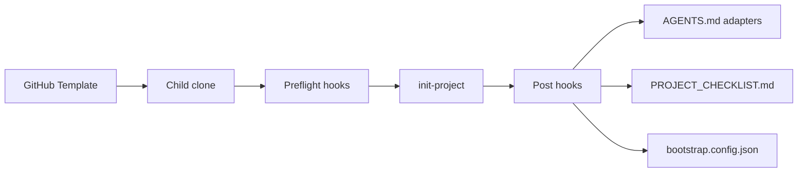

# Product Specification

> Spec-driven development stub. Fill after `init-project`. Feature slices still use `docs/features/{name}.md`.
> Status markers: 🔲 open · ✅ done · ❌ blocked.

## Overview

<!-- product-brief-sync:begin -->
> Read `AGENT.md` before any sprint row.

**One-liner:** Offline PWA that lets a StarRupture player plan a West-to-East city layout from a curated unlock checklist, with no internet connection.
**Do not drift:** starrupture, city planning, west-to-east, unlock checklist, offline pwa, localstorage, grid layout, pwa, web

**Rules:**
- LocalStorage-only persistence; no API, no backend, no telemetry.
- Keep FOSS (MIT); no paid SaaS, no analytics, no third-party runtime deps.
- Lighthouse performance / a11y / best-practices budgets stay ≥ 0.9 (see `docs/DESIGN_GUIDE.md` and `.lighthouserc.json`).
- Static data (unlock checklist) ≤ 300 lines per file; pure logic ≤ 150 lines per file (repo hard limits).
- i18n: strings in `src/locales/en.json` (default) and `src/locales/es.json`; never inline copy in components.
- Machine QA only — do not ask a human to review every frame/step of a layout.
- Do not overwrite the Sacred `branding/` vector assets (`branding/BRANDING.md`).

**First milestone:** Unlock-checklist data model + seeded localStorage persistence + a working grid view where the user can place/checklist-toggle buildings and save their plan — fully offline, Lighthouse ≥ 0.9 floors met.
<!-- product-brief-sync:end -->

**Product:** agent-project-bootstrap
**Purpose:** GitHub Template Repository that bootstraps FOSS projects with Cursor-ready agent routing, CI, and Golden Path examples.
**Users:** Humans and AI agents initializing or maintaining a child repo. Read `AGENT.md` on a child before Golden Path About/donate work.

## Functional Requirements & User Stories

| ID | Story | Acceptance |
|----|-------|------------|
| FR-1 | As a maintainer I run `scripts/init-project.sh` so the child repo is customized | Manifest, adapters, and checklist exist; unused stacks prune when asked |
| FR-2 | As an agent I read `AGENTS.md` first so I follow architecture and test-first rules | Adapters for Cursor, Claude Code, and Copilot stay in sync |
| FR-3 | As a reviewer I get CI + security on every PR without opting in | `ci.yml`, `security.yml`, Dependabot, issue/PR templates present |

## Non-Functional Constraints

- MIT default (Apache-2.0 selectable at init for child repos)
- No proprietary SDKs on the FOSS production path
- Opt-in telemetry only; never enabled by default
- File budgets: 300 lines static data, 150 lines pure logic
- Preflight fails clearly when `git` or Python is missing

## Architecture & Data Flow

## Test-first rule

Every feature in `docs/plan.md` / BUILD_PLAN must list tests, or state why automation is not feasible and name the fallback command.
